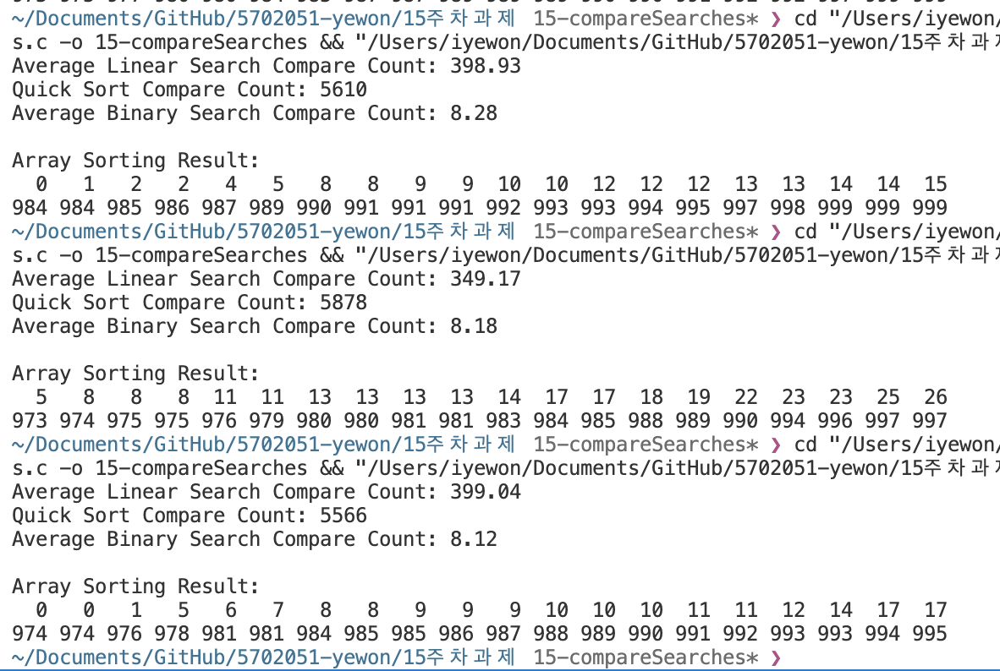

이진 탐색은 정렬된 배열에서 값을 찾는 방법으로 매번 배열을 절반으로 나누기 때문에 비교횟수가 O(log n)이 됩니다
순차 탐색은 정렬에 상관없이 첫번째 값부터 마지막 값까지 하나씩 비교하기 때문에 비교횟수가 배열 크기에 비례해서 O(n)이 됩니다.
퀵 정렬 후 이진 탐색은 정렬된 배열의 값의 위치를 보다 쉽게 찾을 수 있어 순차 탐색보다 비교 횟수가 이진 탐색이 효율적으로 작동합니다.
