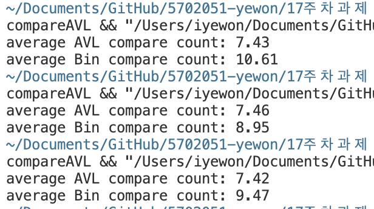

이진 탐색 트리는 각 노드가 최대 두 개의 자식을 가지고
탐색 시 루트 노드부터 시작하여 키를 비교하면서 이동하는 구조를 가지고 있습니다. 
하지만 트리의 균형이 유지되지 않으면 최악의 경우 트리가 한쪽으로 편향될 수 있습니다. 
이로 인해 탐색 성능이 저하될 가능성이 있습니다.

AVL 트리는 이진 탐색 트리의 특성을 가지면서도 높이 균형을 유지하도록 설계되었습니다. 
삽입 및 삭제 시마다 균형 상태를 유지하기 때문에 AVL 트리에서 탐색 시 비교 횟수는 항상 일정하게 유지됩니다.

랜덤한 값을 삽입하는 코드에서 AVL 트리는 트리의 균형을 유지하기 때문에 평균 비교 횟수가 일정하게 유지됩니다. 
이진 탐색 트리는 삽입 순서에 따라 균형이 무너질 수 있고 이 경우 특정 노드에 도달하기 위해 더 많은 비교가 필요할 수 있습니다. 
